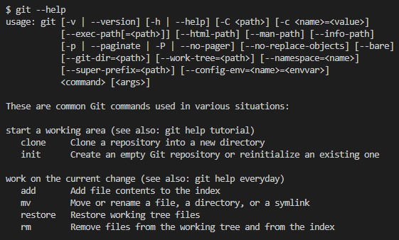

# Инструкция по работе с GIT _(через терминал)_ 


```
_$ git [command] --help_ - подсказки по команде
```

**Пример:**


## Настройка


```
_$ git config --global user.name "user_name"_ - добавление пользователя

_$ git config --global user.email "email_name"_ - добавление почты пользователя

_$ git config user.name - просмотр информации пользователя (Имя)

_$ git config user.email - просмотр информации пользователя (email)
```

## Инициализация репозитория

в нужной папке 

```
_$ git init_
```

## Ветви

```
_$ git branch_ - просмотр текущей

_$ git branch [branch_name]_ - создание новой ветви

_$ git status_ - просмотр текущего статуса ветки
```

## Переходы 

```
_$ git checkout [point/branch]_ - переход между точками/ветвями
_$ git checkout -b [name]_ - переход на созданную ветку
```

## Работа с файлами

```
_$ git add [filename1] [filename2]..._ - указание файлов для сохраниения в репозиторий
```

* Обновление репозитория

```
_$ git commit -m "point memo"_ - Сохранение точки с пояснением
_$ git commit -a -m "point memo"_ - Сохранение точки с пояснением для всех ранее известных и измененных файлов
```

* Изменение последнего коммита

```
_$git commit --amend_ - без необходимости добавления нового пояснения

_$ git log_ - просмотр списка коммитов (точек сохранения)

_$ git log --online_ - просмотр списка коммитов (точек сохранения) в сокращенном варианте, одной строкой на коммит
```

## .gitignore file ##

## Примечание. Bash ##

```
_$ cd [folder]_ -  переход по папкам

_$ ls_ -  просмотр содержимого текущей папки

_$ mkdir [folder]_ - создать папку

_> [filename]_ - вывод информации в файл с перезаписью файла

_>> [filename]_ - вывод информации в файл с дополнением файла

_$ cat [file]_ - просмотр содержимого файла (выход - q)

_$ man [command]_ - просмотр информации по команде (*nix)
```


---
cybittheir's **[git/GeekBrain](https://github.com/cybittheir/GBHW/)**
---
